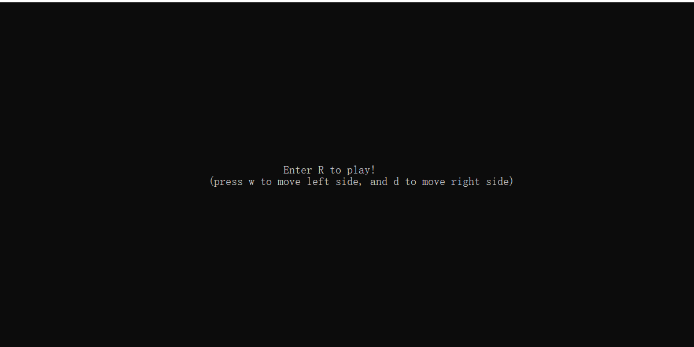
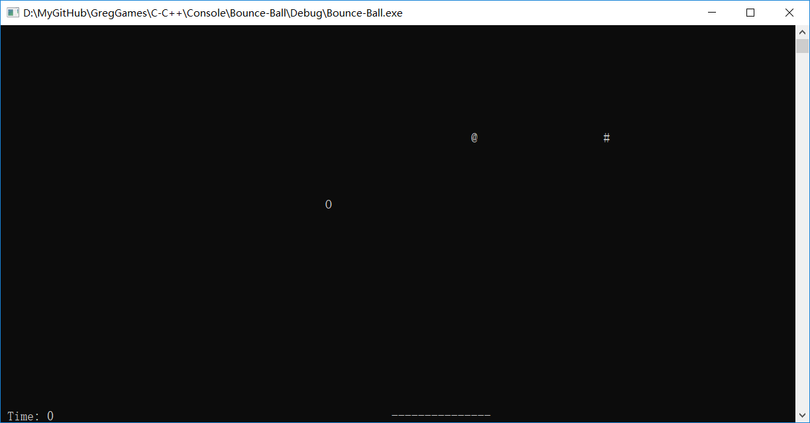
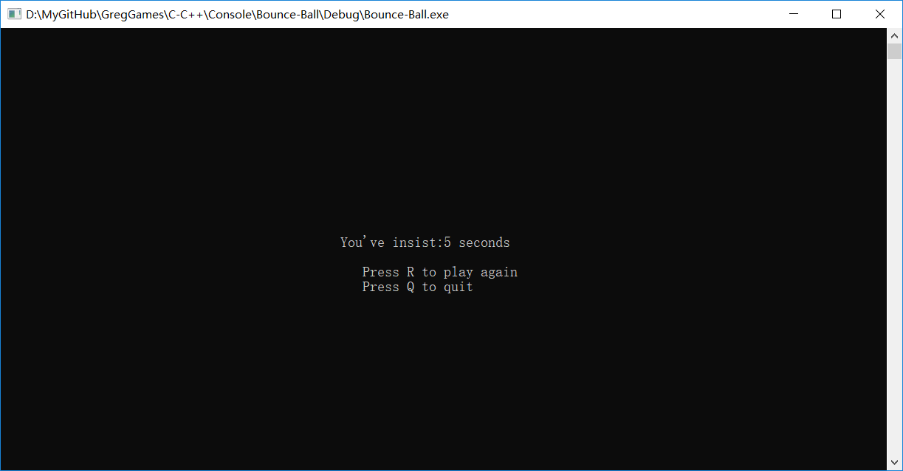

# Bounce Ball

Here is a simple game produced by C++. 
I firmly believe that this program is so easy to read that I don't want to put any comments in here. 
If you have free time to play, I could tell you some details about this game.<.br>

## What's the goal of this game?
The user control the board beneath the scree to protect the falling ball not falling out of the screen. 
You can see that the "____" is the so-called board. 
And the character which has horizental speed is what we called ball. 
The longer you control the ball, the better you have played. 

## How to play?
You can only press A and D to move to left side and right side. 
Remember not to let the board move out of the screen, which will cause undeined error. 

## Which part is the most interesing?
I add a part called buff. The buffs <b>only</b> appear at the beginning of the game. 
That's to say, if you missed them carelessly, you won't have the chance to catch them any more. 
There are 2 kinds of buffs in this game. 
One is to make the board longer. 
The other is to slow down the ball.(Actually, the latter don't work really well) 
You will understand it when you start playing. 

## What's more:
Remember the game itself is hard to playing(and of course it is not funny any more). Good luck! 

Screen shot for this game:

